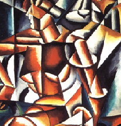

# Assignment: Create AI-generated art

In this assignment you're going to use a process called Artistic Style Transfer. This is a process where we recompose an image in the style of another image by transferring the artistic style from one picture to another using a convolutional neural network.

You can use any image you like for the input image, but I would recommend you use a selfie. 

Here's the image I am going to use:


So this image will be the input and the convolutional neural network will apply artistic style to this image. What this means is that the network is going to repaint this image using a specific style.

And here is the style image we are going to use:



This is a famous cubist image by the painter Lyubov Popova. 

So our challenge is to build an app that can take the artistic cubist style, and use it to completely repaint the input image. If everything works, I'll be fully rendered in cubist style. 

Let’s get started. You need to build a new application from scratch by opening a terminal and creating a new NET Core console project:

```bash
$ dotnet new console -o StyleTransferDemo
$ cd StyleTransferDemo
```

Also make sure to copy the input image and the style image into this folder because the code you're going to type next will expect it here.  

Now install the following packages

```bash
$ dotnet add package CNTK.GPU
```

The **CNTK.GPU** library is Microsoft's Cognitive Toolkit that can train and run deep neural networks. It will train and run deep neural networks using your GPU. You'll need an NVidia GPU and Cuda graphics drivers for this to work. 

If you don't have an NVidia GPU or suitable drivers, the library will fall back and use the CPU instead. This will work but training neural networks will take significantly longer.

CNTK is a low-level tensor library for building, training, and running deep neural networks. The code to build deep neural network can get a bit verbose, so I've developed a little wrapper called **CNTKUtil** that will help you write code faster. 

Please [download the CNTKUtil files](https://github.com/mdfarragher/DLR/tree/master/CNTKUtil) in a new **CNTKUtil** folder at the same level as your project folder.

Then make sure you're in the console project folder and crearte a project reference like this:

```bash
$ dotnet add reference ..\CNTKUtil\CNTKUtil.csproj
```

Now you are ready to start writing code. Edit the Program.cs file with Visual Studio Code and add the following code:

```csharp
using System;
using System.Collections.Generic;
using CNTKUtil;
using OpenCvSharp;

namespace StyleTransferDemo
{
    /// <summary>
    /// The application class.
    /// </summary>
    class Program
    {
        // paths to the content and style images
        static readonly string contentImagePath = "content.png";
        static readonly string styleImagePath = "style.png";

        // the width and height to resize the images to
        static readonly int imageHeight = 400;
        static readonly int imageWidth = 381;

        /// <summary>
        /// The main program entry point.
        /// </summary>
        /// <param name="args"></param>
        static void Main(string[] args)
        {
            // check compute device
            Console.WriteLine($"  Using {NetUtil.CurrentDevice.AsString()}");

            // load images
            var contentImage = StyleTransfer.LoadImage(contentImagePath, imageWidth, imageHeight);
            var styleImage = StyleTransfer.LoadImage(styleImagePath, imageWidth, imageHeight);

            // the rest of the code goes here...
        }
    }
}
```

The code calls **NetUtil.CurrentDevice** to display the compute device that will be used to train the neural network.  

Then we use the **StyleTransfer** helper class and call **LoadImage** twice to load the content image and the style image. 

Now we need to tell CNTK what shape the input data has that we'll train the neural network on: 

```csharp
// create the feature variable
var featureVariable = CNTK.Variable.InputVariable(new int[] { imageWidth, imageHeight, 3 }, CNTK.DataType.Float);

// the rest of the code goes here...
```

We are training the neural network with a dreaming layer which has the exact same width and height as the content and style images. So our input tensor is **imageWidth** times **imageHeight** times 3 color channels in size, and each pixel channel is a **float** that can be individually trained. 

Our next step is to design the neural network. We're going to use the VGG19 network but only keep the convolutional layers for detecting content and style loss:

```csharp
// create the neural network base (just the content and style layers)
var model = featureVariable
    .VGG19(freeze: true)
    .StyleTransferBase();

// the rest of the code goes here...
```

Note how we're first calling **VGG19** to load the complete VGG19 network and freeze all layers. We then call **StyleTransferBase** which will remove the classifier and only keep the convolutional base for style transfer.

Next we need to set up the labels to train the neural network on. These labels are the feature activation and Gramm Matrix values in the content and style layers of the neural network when we show it the content respectively the style image:

```csharp
// calculate the labels
var labels = StyleTransfer.CalculateLabels(model, contentImage, styleImage);

// the rest of the code goes here...
```

Calculating the labels from the model and the content and style images is a complex operation, but fortunately there's a handy method called **CalculateLabels** that does it all automatically. The result is a **float[][]** array that contains the desired activation levels in the content and style layers that will let the neural network know that style transfer has been achieved.

The neural network is almost done. All we need to add is a dreaming layer to generate the mixed image:

```csharp
// add the dream layer
model = model.DreamLayer(contentImage, imageWidth, imageHeight);

// the rest of the code goes here...
```

The dreaming layer is an input layer for the neural network that represents an image where every pixel is an individually trainable parameter. During the training process, the pixel colors in the dreaming layer will change in order to produce the mixed image.

Next we need to tell CNTK what shape the output tensor of the neural network will have. This shape is a bit complex because we're looking at feature activation and Gramm Matrix values in the content and style layers of the neural network. But we can programmatically calculate the shape like this:

```csharp
// create the label variable
var contentAndStyle = model.GetContentAndStyleLayers();
var labelVariable = new List<CNTK.Variable>();
for (int i = 0; i < labels.Length; i++)
{
    var shape = contentAndStyle[i].Shape;
    var input_variable = CNTK.Variable.InputVariable(shape, CNTK.DataType.Float, "content_and_style_" + i);
    labelVariable.Add(input_variable);
}

// the rest of the code goes here...
```

This code calls **GetContentAndStyleLayers** to access the content and style layers in the VGG19 network, loops over all labels in the **labels** array, and constructs an array of CNTK variables with the correct **Shape** value. 

Now we need to set up the loss function to use to train the neural network. This loss function needs to measure the feature activation and Gramm Matrix values in the content and style layers of the neural network, and compare them to the reference activation and Gramm Matrix values when the network is looking at the content and the style images:

```csharp
// create the loss function
var lossFunction = StyleTransfer.CreateLossFunction(model, contentAndStyle, labelVariable);

// the rest of the code goes here...
```

The loss function for style transfer is quite complex, but fortunately we can set it up with a single call to **CreateLossFunction** and providing the model, the content and style layers, and the CNTK label variable.

Next we need to decide which algorithm to use to train the neural network. There are many possible algorithms derived from Gradient Descent that we can use here.

For this assignment we're going to use the **AdamLearner**. You can learn more about the Adam algorithm here: [https://machinelearningmastery.com/adam...](https://machinelearningmastery.com/adam-optimization-algorithm-for-deep-learning/)

```csharp
// set up an AdamLearner
var learner = model.GetAdamLearner(10, 0.95);

// the rest of the code goes here...
```

These configuration values are a good starting point for many machine learning scenarios, but you can tweak them if you like to try and improve the quality of your predictions.

We're almost ready to train. Our final step is to set up a trainer for calculating the loss during each training epoch:

```csharp
// get the model trainer
var trainer = model.GetTrainer(learner, lossFunction, lossFunction);

// the rest of the code goes here...
```

The **GetTrainer** method sets up a trainer which will track the loss during the style transfer process. 

Now we're finally ready to start training the neural network!

Add the following code:

```csharp
// create the batch to train on
var trainingBatch = StyleTransfer.CreateBatch(lossFunction, labels);

// train the model
Console.WriteLine("Training the model...");
var numEpochs = 300;
for (int i = 0; i < numEpochs; i++)
{
    trainer.TrainMinibatch(trainingBatch, true, NetUtil.CurrentDevice);
    if (i % 50 == 0)
        Console.WriteLine($"epoch {i}, training loss = {trainer.PreviousMinibatchLossAverage()}");
}

// the rest of the code goes here...
```

We're training the network for 300 epochs using a training batch set up by the **CreateBatch** method. The **TrainMiniBatch** method trains the neural network for one single epoch. And every 50 epochs we display the loss by calling the **PreviousMinibarchLossAverage** method. 

The neural network is now fully trained and the style and content loss is minimal. We now need to extract the image from the neural network:

```csharp
// create a batch to evaluate the model on
var evaluationBatch = StyleTransfer.CreateBatch(model, labels);

// infer the image from the model
Console.WriteLine("Inferring transformed image...");
var img = model.InferImage(evaluationBatch);

// show image
var mat = new Mat(imageHeight, imageWidth, OpenCvSharp.MatType.CV_8UC3, img, 3 * imageWidth);
Cv2.ImShow("Image With Style Transfer", mat);
Cv2.WaitKey();
```

This code sets up an evaluation batch with **CreateBatch**. Normally we would evaluate the neural network on this batch and create predictions for the labels. But since the image we're interested in is actually stored in the dreaming layer, we can extract it directly from the batch with a call to **InferImage**.

We now have the value for each pixel in a **float[]** array, so we call the **Mat** constructor to project these values to an 8-bit 3-channel color image and call the **ImShow** method to render the image on screen.

Note that **Mat** and **ImShow** are OpenCV features. OpenCV is a flexible image library used by CNTKUtil to implement style transfer. 

Finally we call **WaitKey** so the image remains on screen when the app completes, and we have time to admire the style transfer results.  

We're ready to build the app, so this is a good moment to save your work ;) 

Go to the CNTKUtil folder and type the following:

```bash
$ dotnet build -o bin/Debug/netcoreapp3.0 -p:Platform=x64
```

This will build the CNKTUtil project. Note how we're specifying the x64 platform because the CNTK library requires a 64-bit build. 

Now go to the project folder and type:

```bash
$ dotnet build -o bin/Debug/netcoreapp3.0 -p:Platform=x64
```

This will build your app. Note how we're again specifying the x64 platform.

Now run the app:

```bash
$ dotnet run
```

The app will create the neural network, load the content and style images, train the network on the data, and create a mixed image with the artistic style from the style image applied to the content image.

What does your image look like? Are you happy with the result?

Try out style transfer with other style and content images. What's the best result you can achieve? 

Post your results in our support group.
